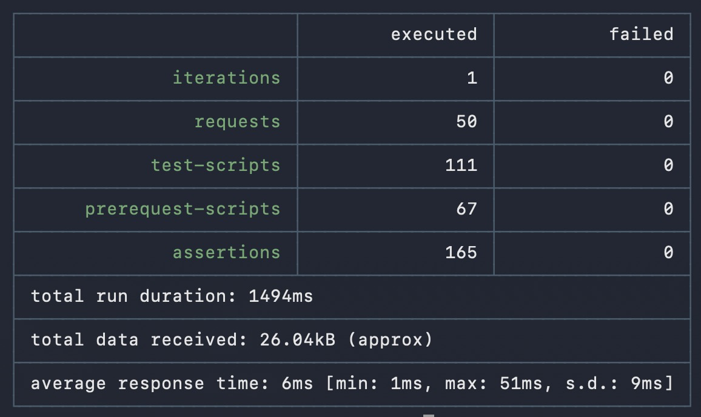

# API Testing - Postman


[](https://github.com/tfariyah31/Postman-API-Testing-Demo/actions/workflows/main.yml)

This project demonstrates API testing using **Postman**, **Newman**, and **GitHub Actions**, tested against a locally hosted Node.js backend application.

## Project Structure
```
Postman-API-Testing-Demo/
├── backend/
│   └── Node.js backend app
├── postman-tests/
│   ├── SimpleWebApp_API.json
│   ├── IterationSimpleWebApp_API.json
│   ├── QA_environment.json
│   └── README.md 
├── newman/
│   └── SimpleWebApp API.html
│   └── Iteration SimpleWebApp.html
├── .github/
│   └── workflows/
│       └── api-tests.yml 
├── README.md

```


## Getting the Backend Up and Running

The backend is a simple Node.js + Express app that supports user registration, login and a product list.

### Tech Stack
`Node.js` · ` Express.js` · `MongoDB` · `Mongoose` · `JWT` 

### Prerequisites

- [Node.js](https://nodejs.org/) v16 or higher
- [MongoDB](https://www.mongodb.com/try/download/community) (local) or a [MongoDB Atlas](https://www.mongodb.com/atlas) cloud URI
- [Git](https://git-scm.com/)


### Setup Instructions
##### 1. Clone the Repository

```bash
git clone https://github.com/tfariyah31/SimpleWebApp.git
cd SimpleWebApp
```

#### 2. Set Up the Backend

```bash
cd backend
npm install
```

Create a `.env` file in the `backend` folder:

```env
PORT=5001
MONGO_URI=mongodb://localhost:27017/mywebapp
JWT_SECRET=your_secret_key_here
```

> Replace `MONGO_URI` with your MongoDB Atlas connection string if using a cloud database. Use a strong, unique value for `JWT_SECRET` — never commit it to version control.

Start the backend server:

```bash
node server.js
```

The backend will be available at `http://localhost:5001`.

---

## Running API Tests Locally

### Tools Used
`Postman` · `Newman + newman-reporter-htmlextra` · `GitHub Actions`

### What’s Included
- Postman test scripts for a simple API app (backend)
- Newman HTML reports
- CI workflow to run tests on every push

### Prerequisites
- [Postman](https://www.postman.com/downloads/) (v10+) **or** [Newman](https://github.com/postmanlabs/newman) (CLI)
- Your backend running at `http://localhost:5001`
- Seed database with initial data, run:
```bash
node seedUser.js
node seeProducts.js
```

### Import the Collection

1. Open Postman → **Import**
2. Select `SimpleWebApp_API.json`
3. The collection and all variables will be loaded automatically


### Configure Variables

Set these in your Postman **Environment** before running:

| Variable | Description | Example |
|----------|-------------|---------|
| `base_url` | API base URL | `http://localhost:5001/api` |
| `blocked_user` | Email of a pre-blocked account (for LG-005) | `blocked@example.com` |
| `blocked_user_pass` | Password for the blocked account | `Password123!` |

### Run Order

For full coverage, run the folders **in this order** so that collection variables are populated sequentially:

```
1. Authentication > User Registration
2. Authentication > Login
3. Products - Protected Route
4. Logout
5. Performance Tests
6. Security Tests
7. End-to-End Flows
```

> **Tip:** Use Postman's **Collection Runner** and enable "Save responses" to capture a full test report.


## Collection Variables

These are auto-managed by test scripts — you do not need to set them manually:

| Variable | Set By | Used By |
|----------|--------|---------|
| `reg_email` | REG-001 pre-request | LG-001, LG-002, E2E flows |
| `reg_password` | REG-001 pre-request | LG-001, LG-002 |
| `reg_saved_email` | REG-001 test script | REG-002 (duplicate check) |
| `access_token` | LG-001 test script | All protected routes |
| `refresh_token` | LG-001 test script | LG-010 |
| `product_id` | PR-002 test script | PR-003, PR-004, PR-005 |
| `tampered_token` | PR-009 pre-request | PR-009 |
| `e2e_token` | FLOW-02 test script | FLOW-03, FLOW-04, FLOW-05 |

---

## Newman CI/CD Integration

Run the full suite headlessly in any CI pipeline:

```bash
# Install Newman
npm install -g newman

# Run collection
newman run SimpleWebApp_API.json \
  --env-var "base_url=http://localhost:3000" \
  --reporters cli,json \
  --reporter-json-export results.json
```

HTMLExtra reports are saved to the ```newman/``` folder by default. To specify a custom output path, append ```--reporter-htmlextra-export newman/my-report.html``` to either command.

## Endpoints Under Test

| Method | Endpoint | Auth Required | Description |
|--------|----------|:---:|-------------|
| `POST` | `/auth/register` | ❌ | Create a new user account |
| `POST` | `/auth/login` | ❌ | Authenticate and receive JWT tokens |
| `POST` | `/auth/refresh` | ❌ | Exchange refresh token for new access token |
| `POST` | `/auth/logout` | ✅ | Invalidate session |
| `GET` | `/products` | ✅ | Fetch all products |
| `POST` | `/products` | ✅ | Create a new product |
| `GET` | `/products/:id` | ✅ | Fetch single product by ID |
| `PUT` | `/products/:id` | ✅ | Update product information |
| `DELETE` | `/products/:id` | ✅ | Delete a product |

---
## Key Testing Principles Demonstrated

- **Happy path + negative testing** for every endpoint
- **Input boundary validation** (missing fields, whitespace, min-length violations)
- **Security-first mindset**: injection attacks, JWT tampering, user enumeration prevention
- **Performance budgets** with explicit SLA assertions (not just console logs)
- **Test isolation** via dynamic data generation — safe to run repeatedly
- **Chained state management** — no manual variable setup between requests
- **Reusable library pattern** for cross-request assertion logic

## Test Coverage
[Test Coverage Details](./postman/README.md)

### 🔄 Continuous Integration with GitHub Actions
This project includes a GitHub Actions workflow that:

- Installs Node.js and Newman
- Runs the Postman test suite on every push or pull request
- Uploads the Newman HTML report as an artifact

You can find the workflow file here:
.github/workflows/api-tests.yml

---

### 📊 Newman Report Preview




## Author
**Tasnim Fariyah**

[](https://github.com/tfariyah31)
[](https://www.linkedin.com/in/tasnim-fariyah/)
---

